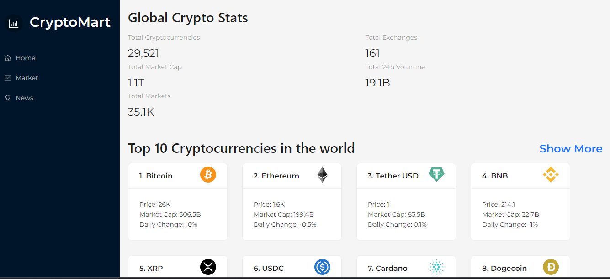
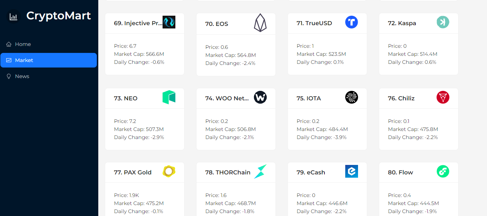
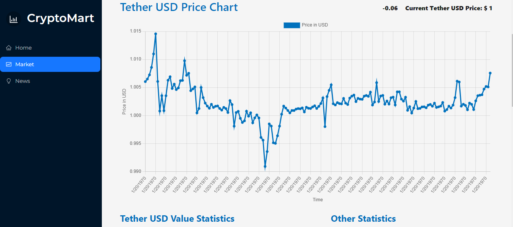

# CryptoMart

CryptoMart is a simple and intuitive cryptocurrency tracking web application. Keep track of your favorite cryptocurrency tokens and coins. Monitor their performance in real-time and stay up-to-date with latest crypto news.

## Table of Contents

- [Features](#features)
- [Screenshots](#screenshots)
- [Getting Started](#getting-started)
  - [Prerequisites](#prerequisites)
  - [Installation](#installation)
- [Technologies Used](#technologies-used)
- [Contributing](#contributing)
- [License](#license)

## Features

- Track multiple cryptocurrencies in one place.
- Real-time price updates from top exchanges.
- Historical price charts for each cryptocurrency.
- User-friendly interface with responsive design.
- Stay up-to-date with latest crypto News.

## Screenshots

Here are some screenshots of the application to get a visual preview:

1. Get global crypto stats.


2. More than 50 tokens and coins available.


3. Stay up-to-date with latest crypto news.


4. Price charts for all the tokens and coins. 


## Getting Started

Follow these instructions to get CryptoMart up and running on your local machine.

### Prerequisites

Before you begin, ensure you have met the following requirements:

- [Node.js](https://nodejs.org/) installed on your computer.

### Installation

1. Clone the repository:

   ```bash
   git clone https://github.com/Ayushhgupta39/cryptomart.git
   cd cryptomart

2. Install the project dependencies:
```bash
npm install
```

3. Start the development server:
```bash
npm start
```

4. Open your web browser and visit http://localhost:3000 to access CryptoMart.

## Technologies Used

CryptoMart is built using the following technologies and libraries:

- **React**: A JavaScript library for building user interfaces.
- **RapidAPI**: Used for real-time cryptocurrency data retrieval.
- **Redux Toolkit**: A library for managing state and API calls in React applications.
- **Ant Design**: A popular UI framework for React applications.

## Contributing

I'd love to welcome contributions from the community! If you want to contribute to CryptoMart, please follow these steps:

1. Fork the repository.
2. Create a new branch for your feature or bug fix.
3. Make your changes and commit them.
4. Push your changes to your fork and create a pull request to the main repository.

## License

This project is not Licensed.